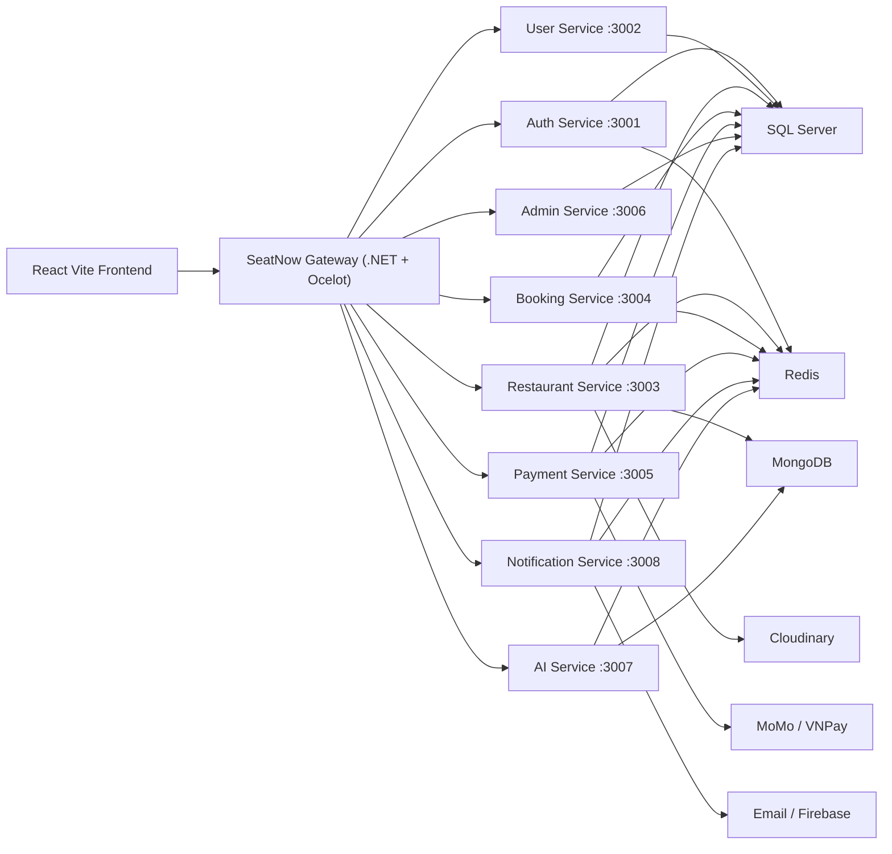

# SeatNow

<p align="center">
  
</p>

<p align="center">
  <strong>A full-stack restaurant discovery, reservation, payment, and operations platform.</strong>
</p>

<p align="center">
  <a href="#overview">Overview</a> |
  <a href="#features">Features</a> |
  <a href="#architecture">Architecture</a> |
  <a href="#getting-started">Getting Started</a> |
  <a href="#project-structure">Project Structure</a>
</p>

<p align="center">
  
  
  
  
</p>

## Overview

SeatNow is a microservices-based restaurant booking system designed for three main user groups:

- **Customers** discover restaurants, view menus and galleries, reserve tables, pay deposits, track bookings, and leave reviews.
- **Restaurant owners** manage restaurant profiles, tables, menus, bookings, revenue, wallets, withdrawals, and AI-powered business insights.
- **Administrators** monitor the platform, approve partner requests, manage users and venues, review transactions, configure commissions, and audit activity.

The platform combines a React single-page application, a .NET API gateway, Node.js domain services, a FastAPI AI service, SQL Server for relational data, MongoDB for document-oriented data, and Redis for caching, locks, sessions, chat history, and queues.

## Features

### Customer Experience

- Restaurant discovery with detail pages, menus, galleries, and reviews.
- Real-time table booking flow with availability checks and table selection.
- Deposit payment workflow through supported payment providers.
- Booking history, booking detail pages, QR-based check-in support, and guest booking tracking.
- AI assistant for restaurant recommendations and conversational discovery.

### Restaurant Owner Experience

- Owner portal for managing multiple restaurants.
- Per-restaurant workspace with dashboard, profile, opening hours, deposit policy, menu, tables, bookings, revenue, wallet, settings, and QR scanning.
- Floor/table management and live operational views.
- Booking status actions, cancellation handling, transaction history, top-up, and withdrawal requests.
- AI chat and revenue insight pages for portfolio-level and restaurant-level analysis.

### Admin Experience

- Admin dashboard with system-level statistics and service health.
- User, partner, restaurant, booking, transaction, and withdrawal management.
- Partner request review workflow.
- Commission configuration and audit/activity tracking.
- Admin AI chat and analytics pages.

## Architecture



## Service Map

| Service | Path | Default Port | Main Responsibility |
| --- | --- | ---: | --- |
| API Gateway | `Final Project BE/SeatNow.GateWay` | `7000` | Ocelot routing, gateway-level JWT validation, service aggregation entry point |
| Auth Service | `Final Project BE/auth_service` | `3001` | Registration, login, JWT, OTP, Firebase auth integration, partner requests |
| User Service | `Final Project BE/user_service` | `3002` | User profiles, customer and owner account data |
| Restaurant Service | `Final Project BE/restaurant-service` | `3003` | Restaurants, menus, tables, reviews, owner portfolio data |
| Booking Service | `Final Project BE/booking-service` | `3004` | Reservations, availability, table holds, QR check-in, booking lifecycle |
| Payment Service | `Final Project BE/payment-service` | `3005` | Deposits, wallet operations, payment callbacks, withdrawals |
| Admin Service | `Final Project BE/admin-service` | `3006` | Admin dashboards, approvals, users, platform configuration |
| AI Service | `Final Project BE/AI-service` | `3007` | Restaurant recommendations, AI chat, revenue analytics |
| Notification Service | `Final Project BE/notification-service` | `3008` | Web notifications, activity feeds, email, Firebase push support |
| Frontend | `Final Project FE/frontend` | `5173` | Customer, owner, and admin web application |

## Tech Stack

### Frontend

- React 19, Vite, React Router, TanStack Query, Zustand.
- Tailwind CSS, Lucide React, Framer Motion, Recharts, Swiper.
- Axios, Socket.IO Client, Firebase, Cloudinary, Leaflet, i18next.

### Backend

- Node.js, Express, Nodemon, Joi/Zod-style validation patterns.
- .NET 8 gateway with Ocelot.
- Python FastAPI AI service with Uvicorn.
- Socket.IO for booking and notification real-time flows.

### Data and Integrations

- SQL Server for core relational data.
- MongoDB for document-based restaurant and AI-related data.
- Redis for locks, queues, cache, chat history, sessions, and TTL-based workflows.
- Firebase, Cloudinary, Nodemailer/SMTP, MoMo, VNPay.

## Project Structure

```text
.
|-- Final Project BE/
|   |-- SeatNow.GateWay/          # .NET Ocelot API gateway
|   |-- auth_service/             # Authentication and authorization
|   |-- user_service/             # User profile domain
|   |-- restaurant-service/       # Restaurant, menu, table, review domain
|   |-- booking-service/          # Booking and availability domain
|   |-- payment-service/          # Payments, deposits, wallets, withdrawals
|   |-- admin-service/            # Admin operations and platform settings
|   |-- notification-service/     # Notifications, activity, email, push
|   |-- AI-service/               # FastAPI AI recommendation and analytics service
|   `-- run_all_console.js        # Starts all backend services in one console
|
|-- Final Project FE/
|   `-- frontend/
|       |-- src/app/              # Router, providers, store
|       |-- src/features/         # Feature modules
|       |-- src/shared/           # Shared UI, layouts, guards, utilities
|       |-- src/lib/              # API clients and integrations
|       `-- src/config/           # Routes and environment config
|
`-- README.md
```

## Getting Started

### Prerequisites

Install the following before running the project:

- Node.js and npm.
- Python 3.x.
- .NET 8 SDK.
- SQL Server.
- MongoDB.
- Redis.
- ODBC Driver 17 or newer for SQL Server, if using the Node SQL Server services with ODBC.

### Environment Variables

Each backend service uses its own `.env` file. Existing local `.env` files are not included here for security, but the project expects variables in these categories:

```env
PORT=3001

DB_SERVER=localhost
DB_PORT=1433
DB_NAME=SeatNow
DB_USER=your_user
DB_PASSWORD=your_password
DB_ENCRYPT=false
DB_TRUST_CERT=true
DB_ODBC_DRIVER=ODBC Driver 17 for SQL Server

MONGO_URI=mongodb://localhost:27017/seatnow
REDIS_URL=redis://127.0.0.1:6379

JWT_ACCESS_SECRET=replace_me
JWT_REFRESH_SECRET=replace_me
JWT_ACCESS_EXPIRES_IN=15m
JWT_REFRESH_EXPIRES_IN=7d

INTERNAL_SERVICE_TOKEN=replace_me
FRONTEND_URL=http://localhost:5173
APP_BASE_URL=http://localhost:5173
```

Frontend environment variables are read from Vite:

```env
VITE_API_BASE_URL=http://localhost:7000/api/v1/
VITE_CLOUDINARY_CLOUD_NAME=your_cloud_name
VITE_CLOUDINARY_UPLOAD_PRESET=your_upload_preset
VITE_CLOUDINARY_API_KEY=your_api_key
```

Payment, email, Firebase, Cloudinary, and AI provider credentials should be configured only in the services that need them.

### Install Dependencies

Install dependencies for each Node.js service:

```powershell
cd "Final Project BE/auth_service"
npm install

cd "../user_service"
npm install

cd "../restaurant-service"
npm install

cd "../booking-service"
npm install

cd "../payment-service"
npm install

cd "../admin-service"
npm install

cd "../notification-service"
npm install
```

Install Python dependencies for the AI service:

```powershell
cd "Final Project BE/AI-service"
pip install -r src/requirements.txt
```

Restore the gateway dependencies:

```powershell
cd "Final Project BE/SeatNow.GateWay/SeatNow.GateWay"
dotnet restore
```

Install frontend dependencies:

```powershell
cd "Final Project FE/frontend"
npm install
```

## Running the Application

### Option 1: Start All Backend Services Together

From the backend root:

```powershell
cd "Final Project BE"
node run_all_console.js
```

This starts:

- Auth, User, Restaurant, Booking, Payment, Admin, Notification services.
- AI FastAPI service.
- .NET API Gateway.

The gateway is available at:

```text
http://localhost:7000
```

### Option 2: Start Services Individually

Node.js services:

```powershell
cd "Final Project BE/booking-service"
npm start
```

AI service:

```powershell
cd "Final Project BE/AI-service"
py src/main.py
```

Gateway:

```powershell
cd "Final Project BE/SeatNow.GateWay/SeatNow.GateWay"
dotnet run
```

Frontend:

```powershell
cd "Final Project FE/frontend"
npm run dev
```

The frontend runs at:

```text
http://localhost:5173
```

## Useful Commands

### Frontend

```powershell
cd "Final Project FE/frontend"
npm run dev
npm run build
npm run preview
npm run lint
```

### Backend Health Checks Through Gateway

```text
GET http://localhost:7000/api/v1/auth/health
GET http://localhost:7000/api/v1/users/health
GET http://localhost:7000/api/v1/restaurants/health
GET http://localhost:7000/api/v1/bookings/health
GET http://localhost:7000/api/v1/payment/health
GET http://localhost:7000/api/v1/admin/health
GET http://localhost:7000/api/v1/ai/health
GET http://localhost:7000/api/v1/notifications/health
GET http://localhost:7000/api/v1/gateway/health
```

## API Testing

Postman collections are included inside service-specific `script/Postman`, `scripts/Postman`, or `scripts/postman` folders. Notable examples:

- `Final Project BE/auth_service/scripts`
- `Final Project BE/restaurant-service/scripts/Postman`
- `Final Project BE/booking-service/scripts/Postman`
- `Final Project BE/payment-service/script/Postman`
- `Final Project BE/notification-service/scripts/postman`
- `Final Project BE/AI-service/scripts/Postman`

Before testing APIs, make sure:

- SQL Server, MongoDB, and Redis are running.
- All required `.env` files are configured.
- The gateway and target downstream service are running.
- JWT-protected endpoints include a valid bearer token.

## Frontend Routes

The React app contains role-specific route groups:

- Public: home, restaurant list/detail, menu, gallery, booking, AI assistant, policies, contact.
- Auth: login, register, forgot password, owner registration flow.
- Customer: profile and booking history.
- Owner portal: restaurant portfolio, global analytics, AI insights, restaurant creation.
- Restaurant workspace: dashboard, profile, menu, tables, bookings, revenue, wallet, settings, AI pages.
- Admin: dashboard, users, restaurants, partner requests, bookings, transactions, withdrawals, settings, AI pages.

## Notes for Development

- The gateway base URL is configured in `Final Project BE/SeatNow.GateWay/SeatNow.GateWay/ocelot.json`.
- The frontend default API base URL is `http://localhost:7000/api/v1/`.
- Booking and notification realtime features use WebSocket routes proxied by the gateway.
- Keep service ports aligned with `ocelot.json` when changing any `PORT` values.
- Do not commit local `.env` files or provider secrets.

## License

This repository was created as a final project for SeatNow. Add a license file before publishing or distributing the project publicly.
